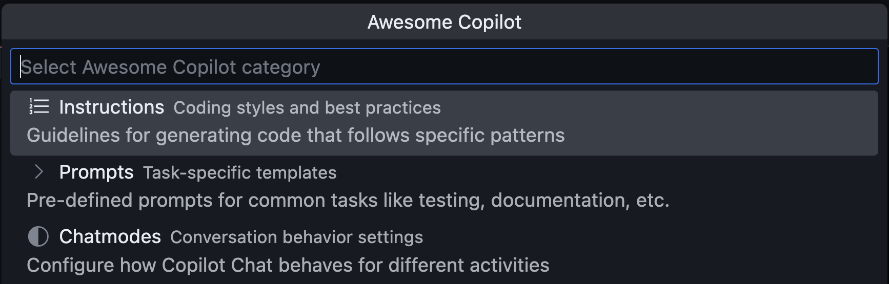

  <a href="awesome-copilot-script">Awesome Copilot Script</a>
  |
  <a href="cursorrules-to-copilot-script">Cursor Rules to Copilot Script</a>
  |
  

# Awesome Copilot Index

This site hosts a daily generated index of the [awesome-copilot](https://github.com/github/awesome-copilot) repository, providing structured access to its GitHub Copilot instructions, prompts, and chat modes. The site is also hosting [Joyride](https://github.com/BetterThanTomorrow/joyride) scripts that use the indexes to bring the content into [VS Code](https://code.visualstudio.com/) for you.

## Download Index Files

- [JSON Format](awesome-copilot.json)
- [EDN Format](awesome-copilot.edn)

| Category | Count |
|----------|------:|
| **Instructions** | 73 |
| **Prompts** | 83 |
| **Chat Modes** | 57 |
| **Total Resources** | 213 |

*Last updated: 2025-09-18 06:07:58 UTC*

## Usage Example

The index powers the **Awesome Copilot** menu in VS Code together with [Joyride](https://github.com/BetterThanTomorrow/joyride) and this script:
- [Awesome Copilot Joyride Script](awesome-copilot-script)
The script includes instructions for how to install it in VS Code/Joyride.

## Index Structure

Each entry in the index contains:

- `filename` - Original markdown filename
- `title` - Extracted from H1 heading or generated from filename
- `description` - From frontmatter if available
- `link` - Relative path to the file in the repository

---

## Support This Project ♥️

If you find this project useful, consider sponsoring me:

Thanks for considering!

---

  <a href="awesome-copilot-script">Awesome Copilot Script</a>
  |
  <a href="cursorrules-to-copilot-script">Cursor Rules to Copilot Script</a>
  |
  

Source for this site: [pez/awesome-copilot-index](https://github.com/pez/awesome-copilot-index)
