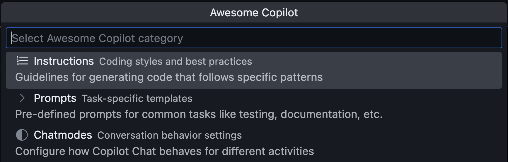

# Awesome Copilot Index

This site hosts a daily generated index of the [awesome-copilot](https://github.com/github/awesome-copilot) repository, providing structured access to its GitHub Copilot instructions, prompts, and chat modes.

| Category | Count |
|----------|------:|
| **Instructions** | {{instruction-count}} |
| **Prompts** | {{prompt-count}} |
| **Chat Modes** | {{chatmode-count}} |
| **Total Resources** | {{total-count}} |

*Last updated: {{formatted-date}}*

The index powers the **Awesome Copilot** menu in VS Code together with [Joyride](https://github.com/BetterThanTomorrow/joyride) and this script:
- [Awesome Copilot Joyride Script](awesome_copilot.cljs)
The script includes instructions for how to install it in VS Code/Joyride.

## Download Index Files

- [JSON Format](awesome-copilot.json)
- [EDN Format](awesome-copilot.edn)

## Index Structure

Each entry in the index contains:

- `filename` - Original markdown filename
- `title` - Extracted from H1 heading or generated from filename
- `description` - From frontmatter if available
- `link` - Relative path to the file in the repository

## Usage Examples

You can use these index files to:

- Build search interfaces for Copilot resources
- Create filtered views by category (instructions, prompts, chatmodes)
- Generate documentation or catalogs
- Power recommendation systems

---

Source for generating: [pez/awesome-copilot-index](https://github.com/pez/awesome-copilot-index)
